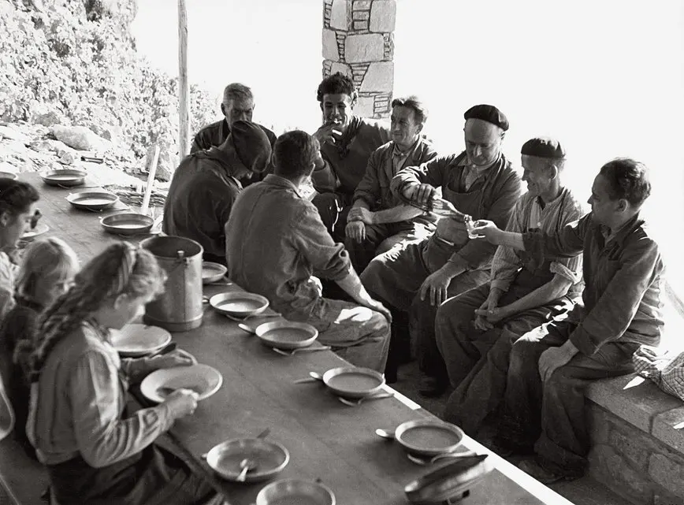
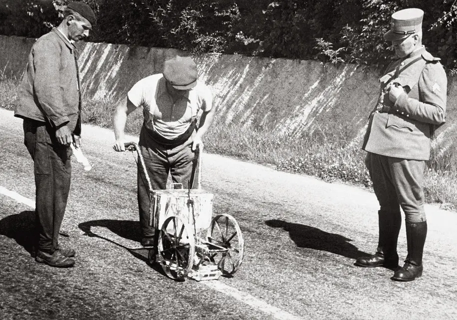

<div class="hero">
  <h1>Cartographie des revenus dans la ville de Lausanne</h1>
  <h2>Une étude de la cartographie des métiers à Lausanne durant le XXe siècle, à partir des annuaires, par le groupe Neuchâtel Fun Machine</h2>

</div>

## Lausanne et l'évolution des métiers au 20e siècle
Lausanne a traversé une transformation majeure de son tissu économique et social au cours du 20e siècle. Au début de cette période, la ville était encore ancrée dans une économie artisanale et industrielle, avec des secteurs comme le textile, le cuir, la construction, la métallurgie et l'alimentation qui jouaient un rôle clé. Les artisans et les ouvriers représentaient une part importante de la population active, surtout en ville, où ils constituaient environ la moitié des chefs de famille.


*1981, l'Ecole des Métiers de Lausanne forme les carrossiers de demain. Fondation Pierre Izard*

L'industrialisation, qui avait commencé dès le 19e siècle, a pris de l'ampleur avec l'arrivée du chemin de fer à Lausanne en 1856, rendant le transport des marchandises et des personnes beaucoup plus facile. Cette nouvelle infrastructure a permis le développement de zones industrielles le long des voies ferrées, notamment dans l'ouest de la ville. En parallèle, le 20e siècle a vu une transition progressive vers une économie de services à Lausanne. Les secteurs des services, du commerce, de l'administration et des professions libérales ont gagné en importance, modifiant ainsi le paysage professionnel de la ville. Cette évolution a été accompagnée d'une urbanisation croissante et d'une diversification des métiers, reflétant les changements socio-économiques au sein de la société lausannoise.



*Pause de midi lors des vendanges. Les hommes d'un côté les femmes et les enfants de l'autre.*


En lien avec cette évolution des métiers, les modes de rémunération ont également évolué. Les salaires étaient versés de différentes manières : à l'heure, au mois, à la pièce ou à la tâche. Ils pouvaient être complétés par des indemnités pour le travail de nuit, les heures supplémentaires, ou encore par des avantages en nature (logement, nourriture, vêtements), des primes ou des pourboires. Ces différentes formes de rémunération illustrent la diversité des conditions de travail selon les métiers et les secteurs. L'analyse historique révèle aussi de fortes disparités salariales : entre les hommes et les femmes, entre les villes et les campagnes, et entre les différentes branches professionnelles.



*1928, Ouchy. Sous le regard débonnaire d'un gendarme, l'un des premiers engins à tracer la ligne des routes. Fondation Pierre Izard*

Ce projet vise à retracer cette dynamique en proposant des graphiques et une carte interactive illustrant la répartition des métiers à Lausanne au cours du 20e siècle. L’objectif est de mettre en lumière les transformations économiques, sociales et spatiales de la ville à travers ses professions, ses secteurs d’activité et les conditions de vie des travailleurs. Les données de la population sont tirées des annuaires lausannois.


# Quelle est la répartition des métiers et des salaires des habitants et habitantes de Lausanne au XXe siècle?


```js
const data1885 = [
    {job: "rentière", count: 531},
    {job: "journalier", count: 313},
    {job: "rentier", count: 201},
    {job: "comis", count: 195},
    {job: "agriculteur", count: 194},
    {job: "couturière", count: 185},
    {job: "ménagère", count: 173},
    {job: "employé", count: 138},
    {job: "cordonnier", count: 130},
    {job: "menuisier", count: 128}
  ]
  const data1901 = [
        { job: "domestique", count: 696 },
        { job: "ménagère", count: 526 },
        { job: "couturière", count: 390 },
        { job: "rentière", count: 296 },
        { job: "manœuvrier", count: 268 },
        { job: "employé", count: 261 },
        { job: "cuisinière", count: 254 },
        { job: "menuisier", count: 251 },
        { job: "maçon", count: 226 },
        { job: "agriculteur", count: 224 }
  ]
  
  const data1923 = [
    {job: "ménagère", count: 754},
    {job: "employe", count: 633},
    {job: "veuve", count: 625},
    {job: "couturière", count: 468},
    {job: "négociant", count: 284},
    {job: "typographe", count: 197},
    {job: "jardinier", count: 183},
    {job: "commis", count: 178},
    {job: "mécanicien", count: 165},
    {job: "institutrice", count: 159}
  ]
  const data1951 = [
        { job: "manœuvrier", count: 556 },
        { job: "représentant", count: 508 },
        { job: "vendeuse", count: 504 },
        { job: "étudiant", count: 452 },
        { job: "maçon", count: 433 },
        { job: "peintre", count: 426 },
        { job: "chauffeur", count: 405 },
        { job: "menuisier", count: 385 },
        { job: "comptable", count: 343 }
  ]
```

<div class="grid grid-cols-2 grid-rows-2 gap-4" style="grid-auto-rows: 504px;">
  <div class="card" id="plot-1885">${
    resize((width) =>
      Plot.plot({
        title: "Top 10 des métiers en 1885",
        width,
        height: 480,
        marginLeft: 100,
        x: { label: "Nombre", labelOffset: 30  },
        y: { label: "Métier", domain: data1885.map(d => d.job), padding: 0.1 },
        marks: [Plot.barX(data1885, { x: "count", y: "job", tip: true })],
        style: {
          fontSize: "12px"
        }
})
    )
  }</div>
<div class="card" id="plot-1901">${
    resize((width) =>
      Plot.plot({
        title: "Top 10 des métiers en 1901",
        width,
        height: 480,
        marginLeft: 100,
        x: { label: "Nombre", labelOffset: 30  },
        y: { label: "Métier", domain: data1901.map(d => d.job), padding: 0.1 },
        marks: [Plot.barX(data1901, { x: "count", y: "job", tip: true })],
        style: {
          fontSize: "12px"
        }
})
    )
  }</div>

  <div class="card" id="plot-1923">${
    resize((width) =>
      Plot.plot({
        title: "Top 10 des métiers en 1923",
        width,
        height: 480,
        marginLeft: 100,
        x: { label: "Nombre", labelOffset: 30  },
        y: { label: "Métier", domain: data1923.map(d => d.job), padding: 0.1 },
        marks: [Plot.barX(data1923, { x: "count", y: "job", tip: true })],
        style: {
          fontSize: "12px"
        }
})
    )
  }</div>

  <div class="card" id="plot-1951">${
    resize((width) =>
      Plot.plot({
        title: "Top 10 des métiers en 1951",
        width,
        height: 480,
        marginLeft:100,
        x: { label: "Nombre", labelOffset: 30 },
        y: { label: "Métier", domain: data1951.map(d => d.job), padding: 0.1 },
        marks: [Plot.barX(data1951, { x: "count", y: "job", tip: true })],
        style: {
          fontSize: "12px"
        }
      })
    )
  }</div>
</div>

---
```js

const avg = FileAttachment("data/plot_data/sector_avg.json").json()
```

<div class="card" id="plot-sector-trends">${
  resize((width) =>
    Plot.plot({
      title: "Évolution des salaires moyens par secteur",
      width,
      height: 480,
      marginLeft: 60,
      marginBottom: 50,
      x: { label: "Annee", type: "linear" },
      y: { label: "Salaire moyen", grid: true },
      color: { legend: true, label: "Secteur", scheme: "category10" },
      marks: [
        Plot.line(avg, {
          x: "Annee",
          y: "salary",
          stroke: "sector"
        }),
        Plot.dot(avg, {
          x: "Annee",
          y: "salary",
          stroke: "sector",
          tip: true
        })
      ],
      style: {
        fontSize: "12px"
      }
    })
  )
}</div>


# Cartes

Pour découvrir les cartes interactives, rendez-vous sur ces liens:

[Par classe de richesse](/carte1)

[Par domaine](/carte2)


# Analyses
- Certains métiers restent stables sur toute la période, comme ménagère, rentier·e ou couturière.
- De nombreux métiers sont genrés : ménagère, couturière (féminins) versus maçon, chauffeur (masculins).
- Les pics de domestiques en 1901 et de ménagères en 1921 illustrent le rôle central de ces fonctions dans l’organisation sociale de leur époque.
  - Leur forte représentation reflète une société structurée autour du travail domestique, souvent féminin, avec une répartition stricte des rôles selon le genre et la classe sociale.
- En 1951, la répartition des professions devient plus équilibrée, signe d’une diversification des emplois.
- Entre 1885 et 1901, la société reste majoritairement rurale et hiérarchisée (rentier·e, domestique, agriculteur).
- En 1923, après la Première Guerre mondiale, on observe les premiers effets de l’industrialisation avec l’apparition de métiers techniques comme typographe ou mécanicien.
- Après la Seconde Guerre mondiale, l’impact de la massification scolaire (hausse des étudiants) et l’émergence de la société de consommation transparaissent dans les données (vendeuse, représentant).

# Limitations
- Biais de sélection : les données proviennent d’annuaires payants, et non des recensements.
  - Les recensements n’ont pas été utilisés car les données salariales ne sont disponibles que pour le XXe siècle, et les recensements de cette période sont encore protégés (données personnelles).
- Nomenclature des métiers : les intitulés sont souvent imprécis ou incohérents.
- Vocabulaire local : certains termes "locaux" comme TL ne sont pas bien interprété par Llama ne sont pas reconnus.
- Hmogénéité salariale par filiale : toutes les personnes d’une même filiale sont regroupées dans une seule catégorie, avec un salaire unique.
  - Exemple : dans “Hôtellerie, restaurants”, le gérant et le portier reçoivent le même salaire.
- Surreprésentation de veuves : la présence de nombreuses veuves dans les données fausse potentiellement l’interprétation.
- nominatim?
  
# Sources
[Wikipedia](https://fr.wikipedia.org/wiki/Lausanne)
[Dictionnaire historique de la Suisse](https://hls-dhs-dss.ch/fr/articles/002408/2009-04-02/)
[Le tissu économique de la région lausannoise](https://www.lausanne.ch/.binaryData/website/path/lausanne/officiel/statistique/publications/apercus-par-statistique-vaud/contentAutogenerated/autogeneratedContainer/col1/00/linkList/00/websitedownload/CS-06-2007_Evolution-de-l-emploi.2018-01-31-16-21-38.pdfm)

<style>

.hero {
  display: flex;
  flex-direction: column;
  align-items: center;
  font-family: var(--sans-serif);
  margin: 4rem 0 8rem;
  text-wrap: balance;
  text-align: center;
}

.hero h1 {
  margin: 1rem 0;
  padding: 1rem 0;
  max-width: none;
  font-size: 14vw;
  font-weight: 900;
  line-height: 1;
  background: linear-gradient(30deg, var(--theme-foreground-focus), currentColor);
  -webkit-background-clip: text;
  -webkit-text-fill-color: transparent;
  background-clip: text;
}

.hero h2 {
  margin: 0;
  max-width: 34em;
  font-size: 20px;
  font-style: initial;
  font-weight: 500;
  line-height: 1.5;
  color: var(--theme-foreground-muted);
}

@media (min-width: 640px) {
  .hero h1 {
    font-size: 90px;
  }
}
</style>
npm 