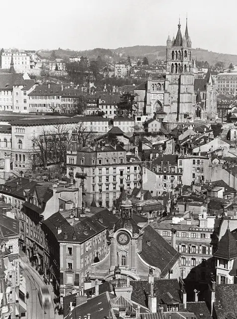
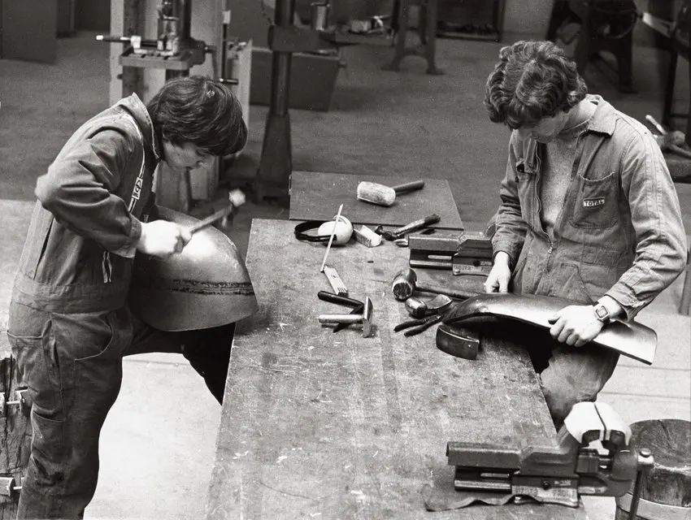
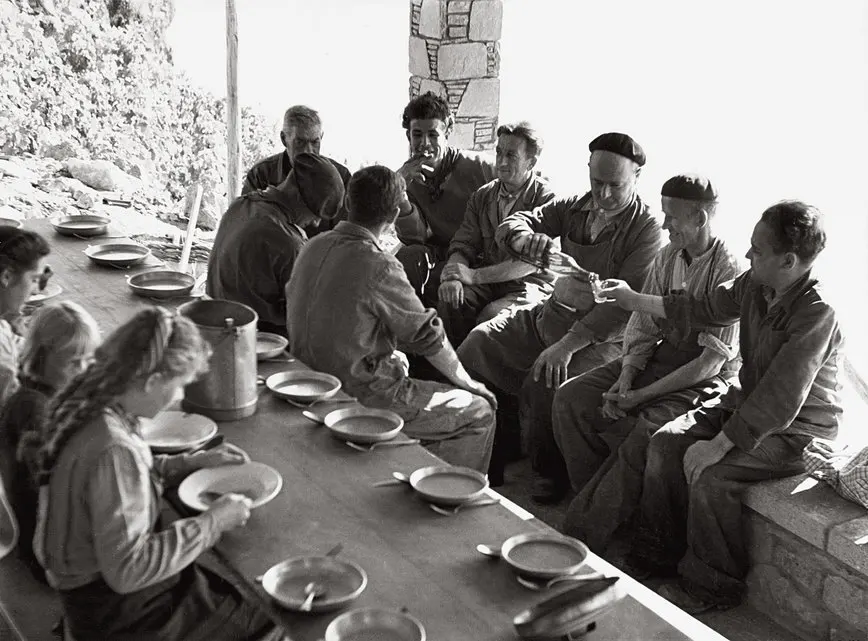
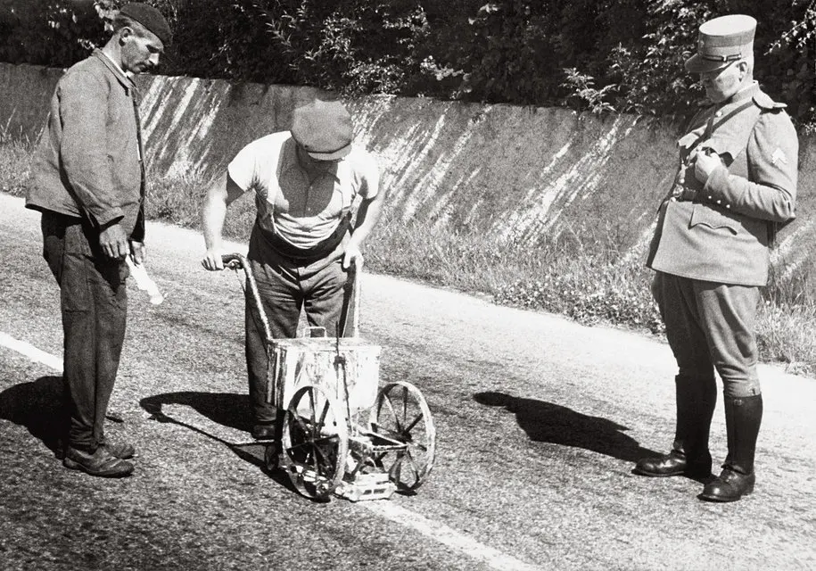
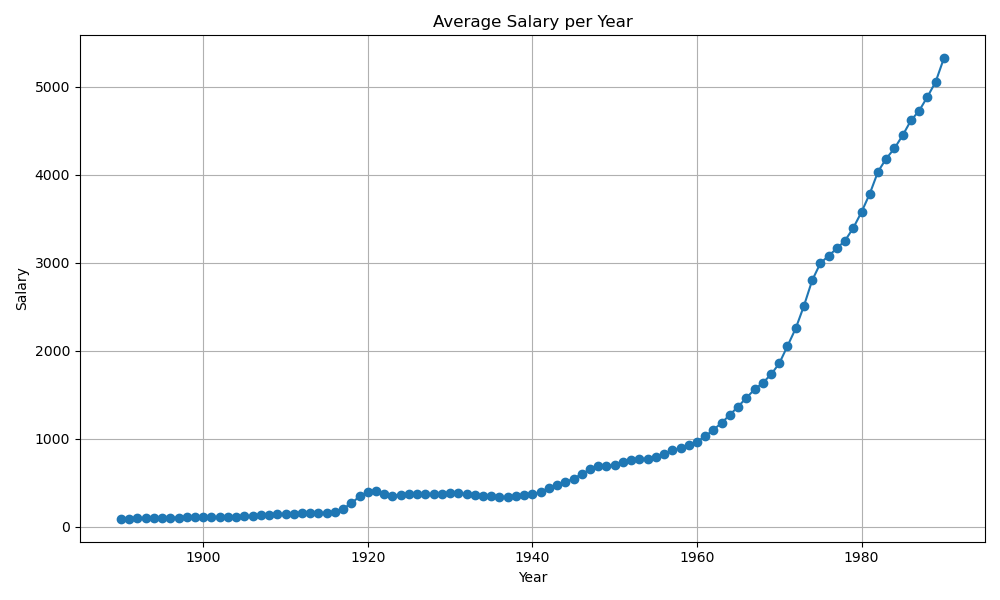
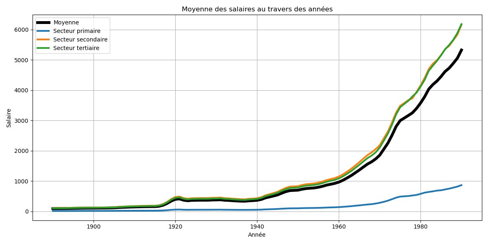

<div class="hero">
  <h1>Neuchâtel Fun Machine</h1>
  <h2>Une étude de la cartographie des métiers à Lausanne durant le XXe siècle</h2>
  
</div>

# Lausanne au fil du temps
Les Romains ont construit un camp militaire aux abords du lac Léman, qu’ils ont nommé Lousanna, vers l’an 14 av. J.-C. Grâce à sa topographie avantageuse – entourée de rivières et perchée sur une colline – Lausanne était l’endroit idéal pour y établir une forteresse. Ce cadre naturel a permis à la ville de durer dans le temps et de croître considérablement. En plus, Lausanne se trouvait sur le tracé de la via Francigena, un important chemin de pèlerinage menant à Rome : un emplacement stratégique, donc !

Après la chute de l’Empire romain, la colline de la Cité offrait un bon refuge pour les habitants en cas d’attaque, le centre de lausanne est donc relocalisé. 

De 888 à 1032, la ville appartenait au Royaume de Haute-Bourgogne. Puis, entre 1032 et 1536, la ville devient une cité épiscopale. La célèbre cathédrale de Lausanne y est érigée en 1275 : c’est la toute première cathédrale gothique de Suisse ! Elle attire de nombreux pèlerins, ce qui contribue à l’essor de la ville.

En 1525, des tensions apparaissent entre les Lausannois et leur évêque. Les Bernois interviennent pour calmer le jeu, puisque Lausanne et Berne étaient liés par un traité de combourgeoisie. Mais en 1536, les Bernois bafouent ce traité : ils prennent Vevey, le château de Chillon, puis envahissent la principauté épiscopale de Lausanne. C’est le début de la Réforme protestante dans la ville. Les Bernois en profitent pour fonder l’Academia Lausannensis, qui deviendra plus tard l’Université de Lausanne. Cet établissement jouera un rôle central durant le siècle des Lumières à Lausanne.

Malgré la tentative d’insurrection du major Davel en 1723, la ville reste sous domination bernoise.

En 1789, c'est la Révolution en France ! Elle inspire les Vaudois, qui rêvent à leur tour de se libérer du joug bernois. Berne tente de freiner cet élan en interdisant les pamphlets et journaux pro-révolutionnaires. Mais en 1798, avec l’aide des troupes de Napoléon Bonaparte, les Vaudois chassent enfin les Bernois. Lausanne devient alors la capitale du canton du Léman, et Napoléon fonde la République helvétique.

En 1847, la première usine à gaz est construite dans le quartier d'Ouchy. C'est le début de la révolution industrielle à Lausanne ! C'est donc l'arivée des métiers  liés à l’énergie, à l’hydraulique, au gaz et à l’industrie. 




*1932, une vue de Lausanne avec l'église Saint-Laurent et la cathédrale depuis le sommet de la tour Bel-Air. Elle fera la une des magazines hebdomadaires durant plusieurs années. Fondation Pierre Izard*


## Lausanne et l'évolution des métiers au 20e siècle
Lausanne a traversé une transformation majeure de son tissu économique et social au cours du 20e siècle. Au début de cette période, la ville était encore ancrée dans une économie artisanale et industrielle, avec des secteurs comme le textile, le cuir, la construction, la métallurgie et l'alimentation qui jouaient un rôle clé. Les artisans et les ouvriers représentaient une part importante de la population active, surtout en ville, où ils constituaient environ la moitié des chefs de famille.



*1981, l'Ecole des Métiers de Lausanne forme les carrossiers de demain. Fondation Pierre Izard*

L'industrialisation, qui avait commencé dès le 19e siècle, a pris de l'ampleur avec l'arrivée du chemin de fer à Lausanne en 1856, rendant le transport des marchandises et des personnes beaucoup plus facile. Cette nouvelle infrastructure a permis le développement de zones industrielles le long des voies ferrées, notamment dans l'ouest de la ville. En parallèle, le 20e siècle a vu une transition progressive vers une économie de services à Lausanne. Les secteurs des services, du commerce, de l'administration et des professions libérales ont gagné en importance, modifiant ainsi le paysage professionnel de la ville. Cette évolution a été accompagnée d'une urbanisation croissante et d'une diversification des métiers, reflétant les changements socio-économiques au sein de la société lausannoise.



*Pause de midi lors des vendanges. Les hommes d'un côté les femmes et les enfants de l'autre.*


En lien avec cette évolution des métiers, les modes de rémunération ont également évolué. Les salaires étaient versés de différentes manières : à l'heure, au mois, à la pièce ou à la tâche. Ils pouvaient être complétés par des indemnités pour le travail de nuit, les heures supplémentaires, ou encore par des avantages en nature (logement, nourriture, vêtements), des primes ou des pourboires. Ces différentes formes de rémunération illustrent la diversité des conditions de travail selon les métiers et les secteurs. L'analyse historique révèle aussi de fortes disparités salariales : entre les hommes et les femmes, entre les villes et les campagnes, et entre les différentes branches professionnelles.



*1928, Ouchy. Sous le regard débonnaire d'un gendarme, l'un des premiers engins à tracer la ligne des routes. Fondation Pierre Izard*

Ce projet vise à retracer cette dynamique en proposant des graphiques et une carte interactive illustrant la répartition des métiers à Lausanne au cours du 20e siècle. L’objectif est de mettre en lumière les transformations économiques, sociales et spatiales de la ville à travers ses professions, ses secteurs d’activité et les conditions de vie des travailleurs.


# Quelle est la répartition des métiers et des salaires des habitants et habitantes de Lausanne au XXe siècle?

## Données, plots

Allez faire un tour dans méthodologie pour découvrir votre salaire de l'époque.


```js
  const data1901 = [
        { job: "domestique", count: 696 },
        { job: "ménagère", count: 526 },
        { job: "couturière", count: 390 },
        { job: "rentière", count: 296 },
        { job: "manœuvrier", count: 268 },
        { job: "employé", count: 261 },
        { job: "cuisinière", count: 254 },
        { job: "menuisier", count: 251 },
        { job: "maçon", count: 226 },
        { job: "agriculteur", count: 224 }
  ]
  const data1951 = [
        { job: "manœuvrier", count: 556 },
        { job: "représentant", count: 508 },
        { job: "vendeuse", count: 504 },
        { job: "étudiant", count: 452 },
        { job: "maçon", count: 433 },
        { job: "peintre", count: 426 },
        { job: "chauffeur", count: 405 },
        { job: "menuisier", count: 385 },
        { job: "comptable", count: 343 }
  ]
```

<div class="grid grid-cols-2" style="grid-auto-rows: 504px;">
  <div class="card" id="plot-1901">${
    resize((width) =>
      Plot.plot({
        title: "Top 10 des métiers en 1901",
        width,
        height: 480,
        marginLeft: 100,
        x: { label: "Nombre", labelOffset: 30  },
        y: { label: "Métier", domain: data1901.map(d => d.job), padding: 0.1 },
        marks: [Plot.barX(data1901, { x: "count", y: "job", tip: true })],
        style: {
          fontSize: "12px" 
        }
})
    )
  }</div>

  <div class="card" id="plot-1951">${
    resize((width) =>
      Plot.plot({
        title: "Top 10 des métiers en 1951",
        width,
        height: 480,
        marginLeft:100,
        x: { label: "Nombre", labelOffset: 30 },
        y: { label: "Métier", domain: data1951.map(d => d.job), padding: 0.1 },
        marks: [Plot.barX(data1951, { x: "count", y: "job", tip: true })],
        style: {
          fontSize: "12px" 
        }
      })
    )
  }</div>
</div>

--- 





# Carte interactive

```js
const div = display(document.createElement("div"));
div.style = "height: 400px;";

const map = L.map(div)
  .setView([46.519653, 6.632273], 13);

L.tileLayer("https://cartodb-basemaps-a.global.ssl.fastly.net/light_all/{z}/{x}/{y}.png", {
  attribution: '&copy; <a href="https://www.openstreetmap.org/copyright">OpenStreetMap</a>'
})
  .addTo(map);

L.marker([46.5232309, 6.6303405])
  .addTo(map)
  .bindPopup("La maison de Soph")
  .openPopup();
```

# Analyses
sign

# Sources
[Wikipedia](https://fr.wikipedia.org/wiki/Lausanne)
[Dictionnaire historique de la Suisse](https://hls-dhs-dss.ch/fr/articles/002408/2009-04-02/)
[Le tissu économique de la région lausannoise](https://www.lausanne.ch/.binaryData/website/path/lausanne/officiel/statistique/publications/apercus-par-statistique-vaud/contentAutogenerated/autogeneratedContainer/col1/00/linkList/00/websitedownload/CS-06-2007_Evolution-de-l-emploi.2018-01-31-16-21-38.pdfm)

<style>

.hero {
  display: flex;
  flex-direction: column;
  align-items: center;
  font-family: var(--sans-serif);
  margin: 4rem 0 8rem;
  text-wrap: balance;
  text-align: center;
}

.hero h1 {
  margin: 1rem 0;
  padding: 1rem 0;
  max-width: none;
  font-size: 14vw;
  font-weight: 900;
  line-height: 1;
  background: linear-gradient(30deg, var(--theme-foreground-focus), currentColor);
  -webkit-background-clip: text;
  -webkit-text-fill-color: transparent;
  background-clip: text;
}

.hero h2 {
  margin: 0;
  max-width: 34em;
  font-size: 20px;
  font-style: initial;
  font-weight: 500;
  line-height: 1.5;
  color: var(--theme-foreground-muted);
}

@media (min-width: 640px) {
  .hero h1 {
    font-size: 90px;
  }
}

</style>
